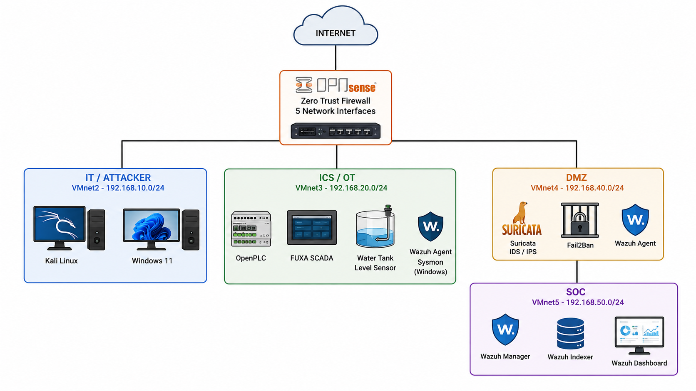
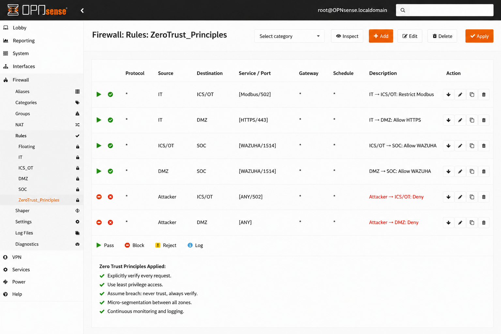
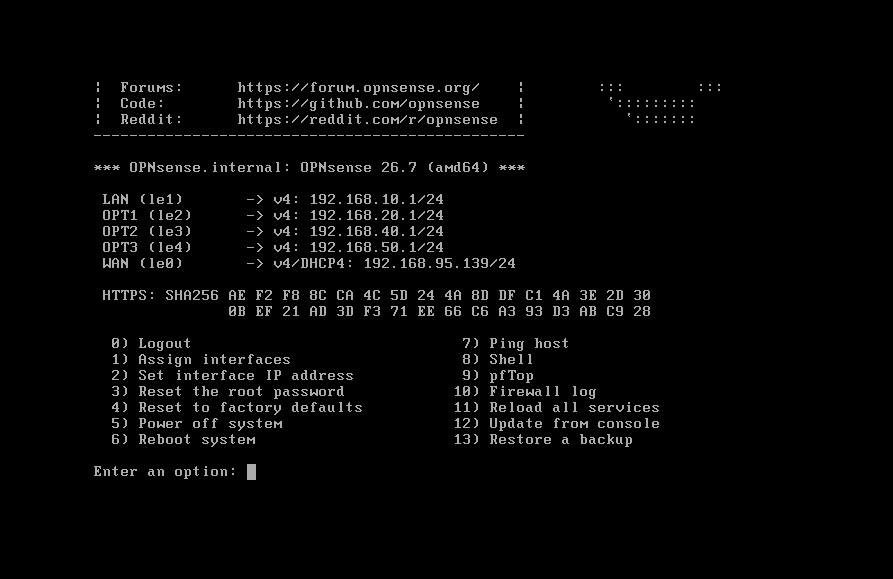
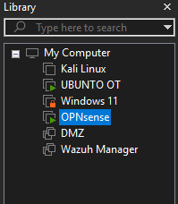

# 🔐 SecureWater OT — ICS/OT Cybersecurity Lab

> **Design and Implementation of a Zero Trust Segmented Architecture for Securing an Industrial Water Treatment Environment**

**Author:** Oussama ERREMICH
**Domain:** Cybersecurity • Network Security • ICS/OT Security • SOC
**Environment:** VMware Virtualized Laboratory

---

## 📌 Project Overview

**SecureWater OT** is a cybersecurity laboratory designed to demonstrate the protection of an **Industrial Control System (ICS/OT)** environment using a **Zero Trust security architecture**.

The project simulates a water-treatment process using **OpenPLC and FUXA**, while implementing network segmentation, strict firewall policies, intrusion detection, endpoint monitoring, and centralized security monitoring.

The objective is to reproduce a realistic industrial cybersecurity scenario in an isolated virtual environment and demonstrate how **defense in depth, network segmentation, least privilege, and continuous monitoring** can reduce the impact of a compromised system.

---

## 🎯 Objectives

The main objectives of the project are to:

* Design a segmented ICS/OT cybersecurity architecture.
* Apply **Zero Trust principles** to industrial network communications.
* Isolate critical OT systems from IT and external networks.
* Restrict industrial protocols and services according to the principle of least privilege.
* Monitor network and host activity.
* Centralize security events inside a SOC environment.
* Simulate security validation and reconnaissance scenarios.
* Analyze architectural weaknesses and document security findings.

---

## 🏗️ Security Architecture

The laboratory is divided into four main security zones connected through **OPNsense**:

| Zone           | Network           | Main Components                    | Purpose                                     |
| -------------- | ----------------- | ---------------------------------- | ------------------------------------------- |
| **IT / Audit** | `192.168.10.0/24` | Windows 11, Kali Linux             | User and security testing environment       |
| **ICS / OT**   | `192.168.20.0/24` | OpenPLC, FUXA, Sysmon, Wazuh Agent | Industrial process and control              |
| **DMZ**        | `192.168.40.0/24` | Suricata, Fail2Ban, Wazuh Agent    | Security monitoring and controlled services |
| **SOC**        | `192.168.50.0/24` | Wazuh Manager, Indexer, Dashboard  | Centralized security monitoring             |

The laboratory uses isolated virtual networks to prevent the simulated industrial environment from interacting with real production infrastructure.

### Architecture Diagram



---

## 🔐 Zero Trust Architecture

The security model is based on four fundamental principles:

### 1. Deny by Default

No communication is allowed unless an explicit firewall rule authorizes it.

### 2. Least Privilege

Each authorized communication is restricted to a specific source, destination, and service.

### 3. Network Segmentation

IT, OT, DMZ, and SOC environments are separated into dedicated network segments.

### 4. Assume Breach

The architecture assumes that a system may already be compromised and focuses on limiting lateral movement and access to critical assets.

---

## 🛡️ Security Controls

### OPNsense

Used as the central firewall and segmentation point between the different security zones.

Main responsibilities:

* Network segmentation
* Access control
* Stateful firewall filtering
* Default-deny policy
* Restriction of OT protocols
* Controlled communication between security zones

### Suricata

Used as a network intrusion detection layer for monitoring suspicious network activity.

### Zeek

Used for network visibility and traffic analysis.

### Wazuh

Used as the central security monitoring platform for:

* Host monitoring
* Log collection
* Security events
* Agent monitoring
* Centralized SOC visibility

### Sysmon for Linux

Used to provide additional visibility into activity occurring on Linux-based OT systems.

### Fail2Ban

Used to monitor and protect authentication services against repeated suspicious login attempts.

---

## 🏭 Industrial Process Simulation

The industrial environment simulates a simplified **water-treatment process**.

The process is built around:

**Sensor → OpenPLC → Modbus TCP → FUXA SCADA → Operator**

### OpenPLC

Acts as the virtual Programmable Logic Controller responsible for the industrial control logic.

### FUXA

Provides the SCADA/HMI interface used to visualize the simulated industrial process.

### Modbus TCP

The laboratory uses Modbus TCP to reproduce a common industrial communication scenario.

The standard Modbus TCP service operates on:

```text
TCP/502
```

Because traditional Modbus TCP does not provide strong native security mechanisms such as authentication and encryption, network-level protection becomes particularly important.

---

## 🔥 Zero Trust Firewall Policy

The communication model follows a strict allow-list approach.

| Source   | Destination | Service              | Action    |
| -------- | ----------- | -------------------- | --------- |
| IT       | ICS/OT      | Modbus TCP `502`     | ✅ Allowed |
| IT       | DMZ         | HTTPS `443`          | ✅ Allowed |
| ICS/OT   | SOC         | Wazuh `1514`         | ✅ Allowed |
| DMZ      | SOC         | Wazuh `1514`         | ✅ Allowed |
| DMZ      | ICS/OT      | Any                  | ❌ Blocked |
| ICS/OT   | IT          | Any                  | ❌ Blocked |
| ICS/OT   | WAN         | Any                  | ❌ Blocked |
| SOC      | Other Zones | Any                  | ❌ Blocked |
| Attacker | ICS/OT      | Any                  | ❌ Blocked |
| Attacker | DMZ         | Any                  | ❌ Blocked |
| Any      | Any         | Unauthorized traffic | ❌ Blocked |

The objective is to minimize unnecessary communication paths and reduce the attack surface of the industrial environment.

---

## 🧪 Security Validation

Security validation was performed from the simulated **Kali Linux attacker/audit machine** located in the IT zone.

### OT Service Accessibility Test

Example validation:

```bash
sudo nmap -Pn -p 502 192.168.20.50
```

The expected result for unauthorized access is:

```text
502/tcp filtered
```

This demonstrates that unauthorized traffic is filtered before reaching the industrial service.

### SCADA / Management Services

Additional validation can be performed against services such as:

```text
1881
8080
8443
```

Unauthorized access is expected to remain filtered according to the Zero Trust firewall policy.

---

## 📊 Security Monitoring

The SOC environment is based on **Wazuh**.

The architecture provides centralized visibility into security events generated by monitored systems.

### SOC Dashboard


The monitoring environment provides visibility across the laboratory and supports investigation of security-related events.

---

## 🖥️ Laboratory Screenshots

### Zero Trust Architecture



### OPNsense Firewall



### FUXA Configuration


### FUXA Connection


### Tag Configuration


### Laboratory Environment



---

## 🔎 Security Findings & Lessons Learned

An important part of the project was not only implementing security controls, but also identifying their limitations.

### Finding 1 — DMZ Topology Weakness

A DMZ machine was configured with connectivity to both the OT and DMZ networks.

This created a potential path that could bypass the OPNsense firewall at Layer 2.

**Lesson learned:**
Firewall rules alone do not guarantee segmentation. The physical or virtual network topology must also be validated.

---

### Finding 2 — Wazuh Agent Connectivity

One monitored agent was identified as disconnected from the Wazuh Manager.

This highlighted the importance of validating not only firewall policies but also the complete monitoring communication path.

---

### Finding 3 — IDS vs IPS

Suricata was deployed primarily for network visibility and intrusion detection.

The laboratory therefore distinguishes between:

* **IDS:** Detection and monitoring
* **IPS:** Inline prevention and traffic blocking

A security tool being installed and running does not automatically mean that its detection or prevention capabilities have been successfully validated.

---

## 🧠 Security Lessons

This project demonstrated several important ICS/OT security principles:

* Segmentation must be validated from the **actual network topology**, not only firewall configuration.
* Zero Trust requires explicit communication policies.
* OT environments require stricter controls because availability and safety are critical.
* Security monitoring must be continuously validated.
* Prevention and detection complement each other.
* A realistic security assessment should document weaknesses instead of presenting only successful controls.

---

## 📚 Security Frameworks & References

The project was designed with reference to established cybersecurity frameworks and guidance, including:

* **NIST SP 800-207 — Zero Trust Architecture**
* **NIST SP 800-82 — Guide to Operational Technology Security**
* **NIST Cybersecurity Framework**
* **MITRE ATT&CK for ICS**
* **IEC 62443 — Industrial Automation and Control Systems Security**
* **Modbus Application Protocol**

These references were used as **design and methodological guidance**, not as certification claims.

---

## 🛠️ Technologies

```text
ICS / OT
├── OpenPLC
├── FUXA
└── Modbus TCP

Network Security
├── OPNsense
├── Suricata
└── Zeek

SOC / Monitoring
├── Wazuh
├── Sysmon for Linux
└── Fail2Ban

Virtualization
└── VMware

Security Testing
└── Kali Linux
```

---

## 📦 Project Contents

This repository contains the main project documentation, architecture diagrams, laboratory screenshots, and the complete project package.

```text
SecureWater-OT-ICS-cybersecurity-project/
│
├── README.md
├── Architecture.png
├── zerotrust.png
├── opnsense.png
├── Wazuh SOC.png
├── Fuxa connect.png
├── config fuxa.png
├── tag configuration.png
├── LAB.png
├── VM edit.png
├── securewater-ot.zip
└── ...
```

The `securewater-ot.zip` archive contains the packaged project materials.

---

## ⚠️ Disclaimer

This project is an **isolated educational cybersecurity laboratory** and is not intended for direct deployment in a production industrial environment.

The laboratory does not claim compliance or certification against NIST, IEC 62443, MITRE ATT&CK, or any other referenced framework.

All security testing was performed within the controlled virtual laboratory.

**Do not apply these configurations to a real industrial environment without appropriate risk assessment, testing, safety analysis, and professional validation.**

---

## 👨‍💻 Author

### Oussama ERREMICH

**Cybersecurity & Networking Engineering Student**

Areas of interest:

`Cybersecurity` • `Network Security` • `ICS/OT Security` • `SOC` • `Zero Trust` • `Network Defense`

---

## ⭐ Project Focus

> **Secure the network. Limit the trust. Monitor everything. Assume compromise.**

**SecureWater OT** demonstrates how Zero Trust principles can be adapted to an industrial cybersecurity laboratory while highlighting both the strengths and limitations of the implemented architecture.
